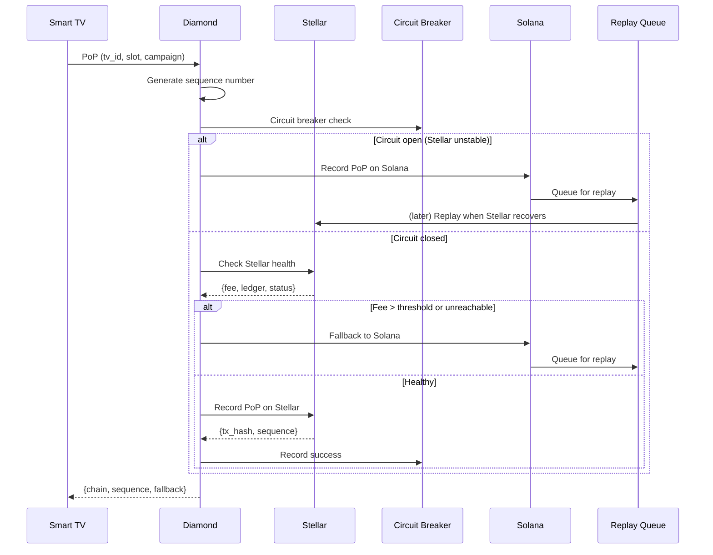
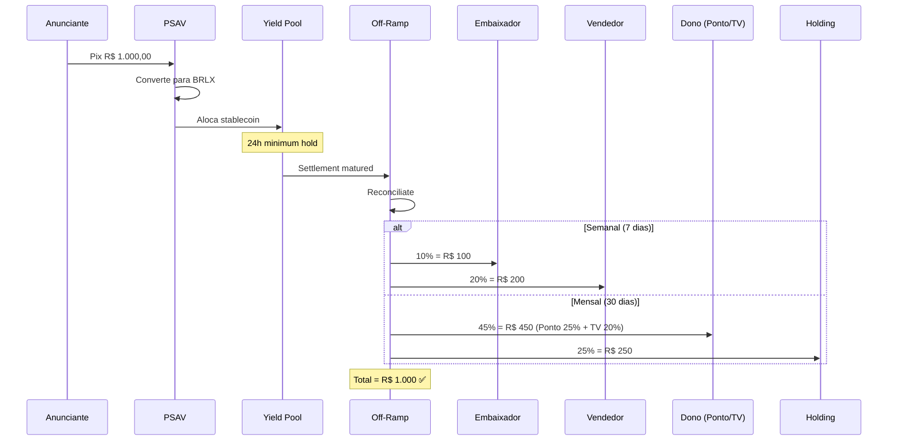

# 🏗️ Arquitetura MOSTARDA

## Diagrama de Contexto

```
                    ┌──────────────────────────────────────────┐
                    │   Hardware (Smart TV / Fire Stick /      │
                    │   ZEROONE Mini PC)                       │
                    │   [mostarda-media-player]                │
                    │  ┌──────┐ ┌──────┐ ┌─────────┐         │
                    │  │ VLC  │ │ WiFi │ │ Camera  │         │
                    │  │Player│ │Sniffer│ │MediaPipe│         │
                    │  └──┬───┘ └──┬───┘ └────┬────┘         │
                    └─────┼────────┼───────────┼──────────────┘
                          │        │           │
                    (HTTPS)  (Métricas)  (Frame descartado
                          │        │      via try/finally)
                          ▼        ▼           ▼
                    ┌──────────────────────────────────────────┐
                    │         FastAPI Application Core         │
                    │  [mostarda-backend]                      │
                    │  ┌──────┐ ┌──────┐ ┌────┐ ┌──────────┐ │
                    │  │Auth  │ │Revenue│ │PSAV│ │Eleições  │ │
                    │  └──────┘ └──────┘ └────┘ └──────────┘ │
                    │  ┌──────┐ ┌──────────┐                   │
                    │  │Off-  │ │YieldPool │                   │
                    │  │Ramp  │ │(DeFi)    │                   │
                    │  └──────┘ └──────────┘                   │
                    └──────────────────┬───────────────────────┘
                                       │
          ┌────────────────────────────┼────────────────────────┐
          │                            │                        │
          ▼                            ▼                        ▼
┌─────────────────┐    ┌─────────────────────────────┐    ┌──────────────┐
│   PostgreSQL    │    │  Diamond EIP-2535           │    │  PSAV        │
│   (Dados)       │    │                             │    │  (Stablecoin)│
│                 │    │  ┌────────┐ ┌────────┐      │    │  Depix/MB/   │
│                 │    │  │Stellar │ │ Solana │      │    │  Liqi        │
│                 │    │  │Primary │ │Fallback│      │    │  ↓ BRLX      │
└─────────────────┘    │  └───┬────┘ └───┬────┘      │    └──────┬───────┘
                       │      │          │            │           │
                       │      └── Replay ─┘            │           ▼
                       │         Queue                 │    ┌──────────────┐
                       │      ┌────────────┐           │    │ Yield Pool   │
                       │      │Circuit     │           │    │ Aave/Compound│
                       │      │Breaker     │           │    │ 24h min hold │
                       │      └────────────┘           │    └──────┬───────┘
                       └─────────────────────────────┘           │
                                                                  ▼
                                                           ┌──────────────┐
                                                           │ Off-Ramp     │
                                                           │ Scheduler    │
                                                           │ Semanal 30%  │
                                                           │ Mensal  70%  │
                                                           └──────────────┘
```

## 📐 Padrões de Design

| Padrão | Uso | Implementação |
|--------|-----|---------------|
| **Diamond EIP-2535** | Smart contracts modulares | Stellar (primária) + Solana (fallback) |
| **Circuit Breaker** | Previne flapping entre chains | 3 falhas → 300s cooldown |
| **Replay Queue** | Re-sync após fallback | Deque max 10k itens, batch 50 |
| **Sequence Generator** | Ordenação cross-chain | Timestamp ms + contador |
| **Saga Coreografada** | Pagamento → Conversão → Yield → Split | Off-ramp scheduler |
| **Fallback Automático** | Stellar → Solana | Fee > 0.001 XLM ou RPC down |
| **Zero-Footprint** | Privacidade LGPD | try/finally + gc.collect() |
| **Retry com Backoff** | Resiliência PSAV | 3 tentativas, jitter, idempotência |

## 🔄 Fluxo de Proof of Play



## 💰 Fluxo Financeiro



## 🧠 Ciclo de Vida dos Dados na Borda

### Face Detection — Zero-Footprint

```
Camera → frame (OpenCV Mat)
         ↓
         cv2.cvtColor(frame, BGR→RGB)
         ↓
         rgb (numpy array)
         ↓
         detector.process(rgb) → results
         ↓
         extrai face_count, attention_score
         ↓
         del results  ← limpeza explícita
         ↓
         _release_frame(frame, rgb)
         ├── np.zeros_like(rgb)  ← defense in depth
         ├── del rgb
         └── del frame
         ↓
         gc.collect() a cada 30 iterações
         ↓
   ✅ Zero pixels na memória
```

**Garantias:**
- `try/finally` — mesmo com exceção em `cvtColor` ou `process`, o frame é liberado
- `gc.collect()` periódico — previne fragmentação de heap em ZEROONE Mini PC
- Apenas agregados (face_count, attention_score) são transmitidos via heartbeat

## 🔐 Blockchain — Mecanismo de Redundância

### Critérios de Fallback

| Condição | Ação | Tempo de Recuperação |
|----------|------|:--------------------:|
| Stellar fee > 0.001 XLM | Fallback para Solana | Próximo PoP |
| Stellar RPC unreachable | Circuit breaker abre (300s) | 5 minutos |
| Solana também falha | PoP enfileirado na Replay Queue | Próximo ciclo de sync |
| Stellar recupera | Circuit breaker half-open → replay batch | Imediato |

### Garantias

1. **Todo PoP tem um sequence number global** — ordenação mantida cross-chain
2. **Fallback é transparente** — PoP sempre registrado em alguma chain
3. **Replay queue preenche gaps** — quando Stellar recupera, lotes são reenviados
4. **Circuit breaker previne flapping** — 3 falhas consecutivas abrem o circuito por 300s
