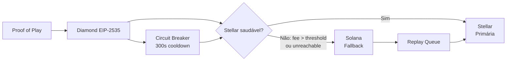
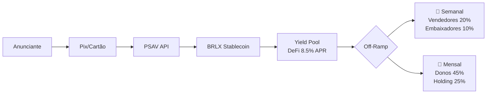

# 🍅 MOSTARDA — Protocolo de Mídia pDOOH Descentralizado

**MOSTARDA** é um ecossistema descentralizado de mídia Digital Out-of-Home (pDOOH) que opera sob governança participativa e divisão automatizada de receitas baseada em papéis.

---

## 📊 Revenue Split (5 Atores)

| Ator | % | Cadência | Função |
|------|---|:--------:|--------|
| **Dono do Ponto** | **25%** | 📆 Mensal | Parede, Wi-Fi, luz, local |
| **Dono da TV** | **20%** | 📆 Mensal | Hardware, manutenção física |
| **Vendedor (Afiliado)** | **20%** | 📅 Semanal | Captação de pontos comerciais |
| **Embaixador (Influenciador)** | **10%** | 📅 Semanal | Curadoria, apresentação, engajamento |
| **Mostarda (Holding)** | **25%** | 📆 Mensal | Software, infraestrutura, suporte |
| **Total** | **100%** | — | — |

> **Stacking:** Um mesmo usuário acumula múltiplos papéis. **Teto máximo: 50%** (TV + Venda + Embaixador).

## ⛓️ Blockchain — Redundância Automática



| Rede | Função | Ativação | Gatilho |
|------|--------|:--------:|---------|
| **Stellar** | Primária — ancoragem PoP, split, votos | ✅ Padrão | Fee baixo e previsível |
| **Solana** | Fallback — contingência | ⚡ Auto | Fee Stellar > 0.001 XLM ou horizon unreachable |

**Segurança:**
- Circuit breaker: 3 falhas consecutivas → aberto por 300s
- Replay queue: PoPs registrados na Solana são reenviados à Stellar quando recupera
- Sequence numbers globais: ordenação cross-chain garantida

## 💳 Pagamentos — PSAV + Off-Ramp



- **PSAV:** Depix, Mercado Bitcoin, ou Liqi
- **Stablecoin:** BRLX (lastreada em Real — sem enviar divisas ao exterior)
- **Yield:** Pool DeFi durante retenção (24h mínimas)
- **Off-ramp:** Lotearmento automático semanal e mensal com reconciliação contábil
- **Retry:** 3 tentativas com backoff exponencial + chave de idempotência

## 🗳️ Governança

| Papel | % | Votante? | Peso |
|-------|---|:--------:|:----:|
| Mostarda (Holding) | 25% | ❌ | — |
| Dono do Ponto | 25% | ✅ | 1.2 × audience |
| Dono da TV | 20% | ✅ | 1.0 × audience |
| Vendedor | 20% | ✅ | 0.8 × audience |
| Embaixador | 10% | ❌ (concorre) | — |

- **Mandato:** 6 meses | **Votação:** Última semana
- **Registro:** Votos na Stellar (hash on-chain)

## 👁️ Privacidade (LGPD — Zero-Footprint)

| Sensor | Dado coletado | Anonimização | Retenção |
|--------|:------------:|:------------:|:--------:|
| Câmera (MediaPipe) | Contagem de faces | Frame descartado **antes** da próxima leitura | 0 — sem armazenamento |
| WiFi (scapy) | Probe requests | MAC → SHA-256 hash | 5 min em memória |
| Player | Heartbeat | Token JWT | Apenas agregados |

> `gc.collect()` a cada 30 iterações para prevenir fragmentação de heap em dispositivos ZEROONE.

## 🏗️ Repositórios

### `mostarda-backend/` — Motor de Negócio
- API RESTful com JWT auth
- Pagamentos PSAV (Depix/MB/Liqi) → stablecoin BRLX
- Revenue split 25/25/20/20/10 com reconciliação contábil
- Blockchain: Stellar (primária) + Solana (fallback) + Diamond EIP-2535
- Circuit breaker + replay queue
- DeFi yield pools durante retenção (24h mínimas)
- Off-ramp scheduler: semanal (30%) + mensal (70%)
- Eleições de embaixador (6 meses)

### `mostarda-media-player/` — Agente Edge
- Player VLC com cache offline
- Sniffer WiFi (scapy) — contagem anônima de público
- Detecção facial (Google MediaPipe) — Zero-Footprint LGPD
- Heartbeat periódico
- Liberação explícita de frames (try/finally), GC periódico

### `mostarda-docs/` — Documentação
- Arquitetura, API, governança, calibração, deploy

## 🖥️ Hardware Homologado

| Dispositivo | Tipo |
|------------|------|
| Smart TV (navegador nativo) | Software |
| Fire Stick / Mi TV Stick | Dongle HDMI |
| **Mini PC ZEROONE Fanless** | Hardware oficial |
| ❌ Raspberry Pi | **Proibido** |

## 🚀 Início Rápido

```bash
# Backend
cd mostarda-backend
cp .env.example .env
# Edite .env com suas chaves (PSAV, Stellar, Solana)
pip install -r requirements.txt
python main.py

# Media Player (no dispositivo ZEROONE)
cd mostarda-media-player
pip install -r requirements.txt
python main.py
```

## 📋 Documentação

| Documento | Descrição |
|-----------|-----------|
| `ARCHITECTURE.md` | Diagramas e fluxos completos |
| `API.md` | Referência REST |
| `DEPLOYMENT.md` | Deploy Docker/Oracle |
| `GOVERNANCE.md` | Regras de eleição e votação |
| `CALIBRATION.md` | Calibração de sensores |
| `ROADMAP.md` | Roadmap de fases |
